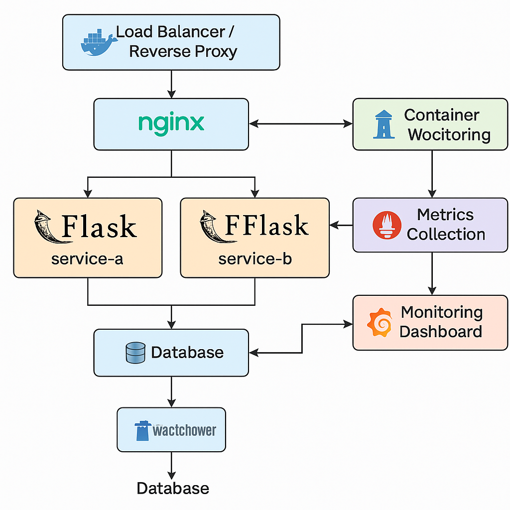
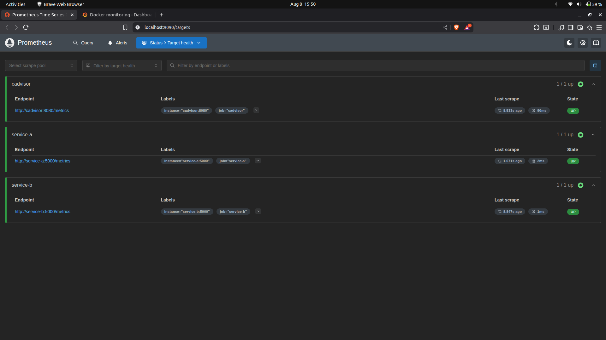
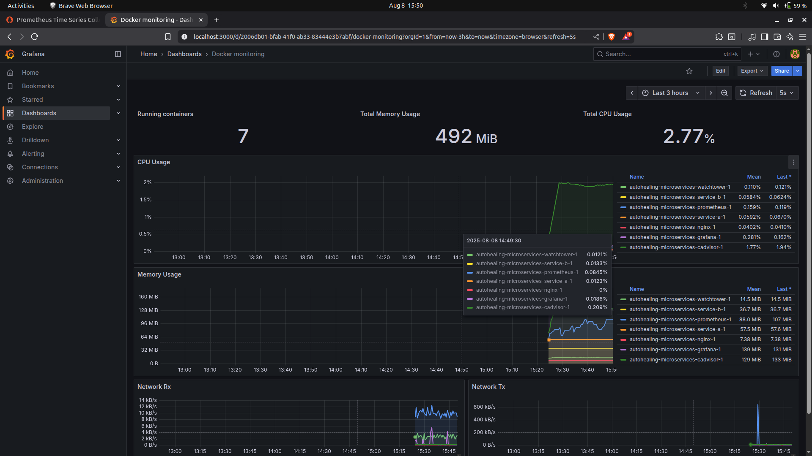
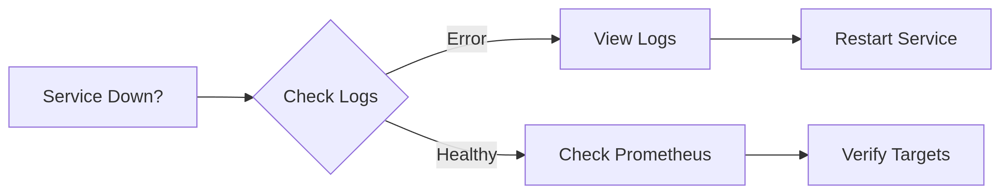

# 🛡️ Auto-Healing Microservices System
_A self-healing microservice architecture with Docker, Flask, Prometheus, and Grafana_

## 📦 System Architecture


## 🚀 Quick Start
```bash
# Clone and deploy
git clone https://github.com/Dasmat13/autohealing-microservices.git
cd autohealing-microservices
docker-compose up -d --build
```

## 🌐 Access Endpoints
| Component   | URL                          | Credentials |
|-------------|------------------------------|-------------|
| Service A   | `http://localhost/a`          | -           |
| Service B   | `http://localhost/b`          | -           |
| Prometheus  | `http://localhost:9090`       | -           |
| Grafana     | `http://localhost:3000`       | admin:admin |

## 🔧 Key Features
- **Self-healing**: Watchtower auto-restarts failed containers
- **Monitoring**: Prometheus scrapes metrics every 15s
- **Visualization**: Pre-configured Grafana dashboards
- **Load Balancing**: Nginx distributes traffic

## 📊 Grafana & Prometheus — Quick Setup Notes
1. Open Grafana: `http://localhost:3000` (admin/admin)
2. Add Prometheus data source: URL → `http://prometheus:9090` and click **Save & Test**
3. Import dashboards:
   - Docker metrics dashboard: Grafana dashboard ID **893** (requires `cadvisor` scraping)
   - Or import custom dashboard JSON (service metrics) — see `grafana/flask-dashboard.json`
4. If Grafana shows "No data": verify Prometheus targets at `http://localhost:9090/targets`

### 📷 Prometheus Dashboard Screenshot


### 📷 Grafana Dashboard Screenshot


## 🛠️ Troubleshooting


Common fixes:
```bash
# Rebuild single service
docker-compose up -d --build service-a

# Check container health
docker ps --filter "health=unhealthy"
```

## 📚 Documentation
- [Prometheus Configuration](./prometheus/README.md)
- [Flask Service Setup](./service-a/README.md)

## 📜 License
MIT © 2023 Dasmat13